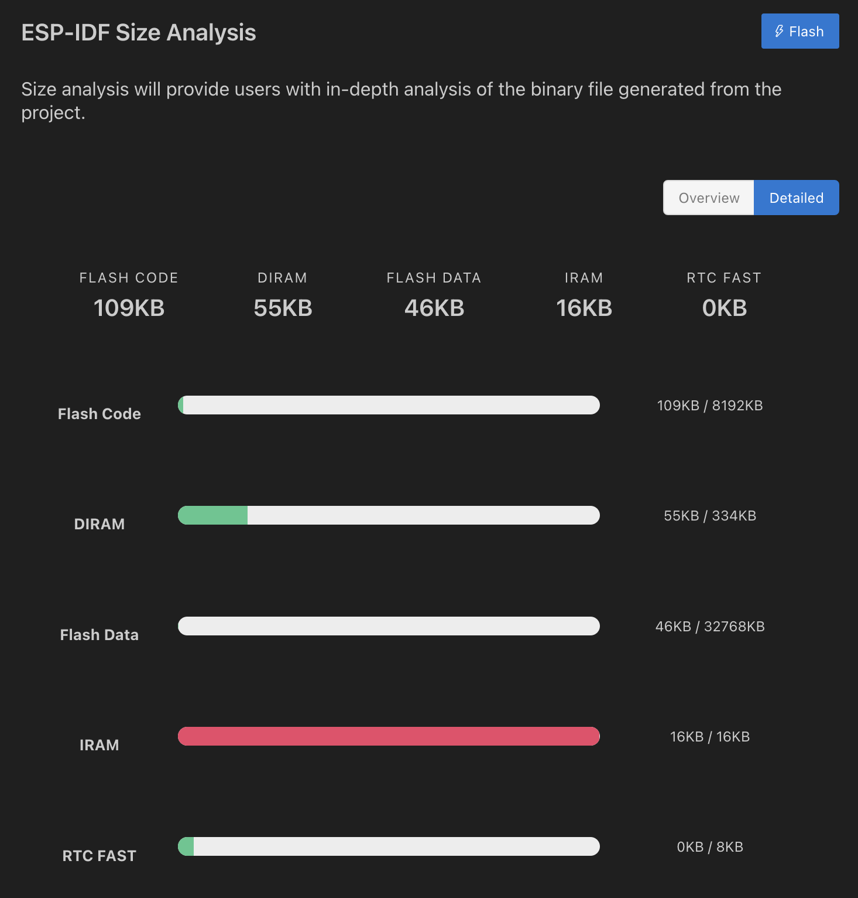

| Supported Targets | ESP32-C2/C3 | ESP32-C5/C6 | ESP32-H2 | ESP32-P4 | ESP32-S2/S3 | T-Display-S3/...S3-AMOLED |
| ----------------- |  ---------- | ----------- | -------- | -------- | ----------- | ------------------------- |
# esp-idf-i2c-mcp23017 new 2025
## List of contents
- [Overview](#overview)
- [Software Required](#software-required)
- [Hardware Required](#hardware-required)
- [How to use this project](#how-to-use-this-project)
- [Build and Flash](#build-and-flash)
- [Example Output](#example-output)
- [ESP-IDF Application Size Analysis](#esp-idf-application-size-analysis)
- [Special thanks](#special-thanks)

## Overview

This is a demonstration application for the ESP32 in the ESP-IDF environment V5.4 with the newer I2C-API `i2c_master`.
In ESP-IDF 5.4, Espressif has revised and improved the I²C API. Therefore, the header file mcp23017.h had to be adapted considerably.

This API structure with “handles” and configuration objects is typical for the newer ESP-IDF I²C API and differs from the older API:
```
i2c_master_bus_handle_t bus_handle;
i2c_master_bus_config_t bus_config = { ... };
err = i2c_new_master_bus(&bus_config, &bus_handle);
```
For more information on the I²C address and other I²C devices, see here:
(https://i2cdevices.org/addresses)

## Software Required
This code has been updated and compiled with the following versions:
- VSCode: March 2025 (version 1.99.1)
- ESP-IDF 5.4.1
- CMake version 3.30.2

## Hardware Required
- ESP32 board<br>
- I2C port expander MCP23017<br>
- 2x 4K7 resistors<br>
- USB cable<br>
- cable for I2C (V+, GND, SDA und SCL)

## How to use this project
You can customize this configuration for your project:
```
#define I2C_SCL 17
#define I2C_SDA 18
#define MCP23017_ADDR 0x20
#define I2C_FREQ_HZ 400000 // 400 kHz (100 ... 800 kHz)
```
Configuration MCP23017 for this System
- 8x Inputs
- 8x Outputs

The 8 inputs (port A) are checked and output at port B.

## Build and Flash

In the footer, you need to review and adjust the following settings:
1. Interface Type
2. The port where the ESP32 board is connected
3. the ESP32 type

The I²C bus allows the use of multiple slaves (FRAMs, LCD, sensors, port extensions, etc.).
Some I²C-devices have pins A0, A1 and A2 for address configuration. Other I²C slaves do have enable pins (CS). This is where you can use GPIO pins.<br>
Attention! The hardware addressing must match the software!
This shows how to datasheet: doc/mcp23017.pdf

Show animation:


## Example Output
```
I (276) main.c says: MCP23017 initialized: NO ERROR
I (276) main.c says: MCP23017 Address: 0x20
I (276) main.c says: I2C Speed: 400 kHz
I (286) main.c says: INTCAP-Wert beim Interrupt: 0x7F
I (286) main.c says: MCP23017 config ok NO ERROR
I (296) main.c says: MCP23017 Port A = INPUTS, Interrupts active LOW
I (296) main.c says: MCP23017 Port B = OUTPUTS

I (156386) main.c says: Time measurement: Current iteration: 347 µs, Average: 349 µs
I (158126) main.c says: Port B: 0xBF (Bits: 10111111)
```

## ESP-IDF Application Size Analysis

The ESP-IDF Application Size Analysis tool provides a detailed breakdown of your application’s memory usage, helping developers optimize storage allocation.<br><br>

Navigate to:
<br>
Press: shift + >  type: `ESP-IDF: Size Analyse of the Binaries`<br>
<br>
<br>


## Special thanks
to NSBum. He provided the older code that I modified/adapted.
https://github.com/NSBum/
