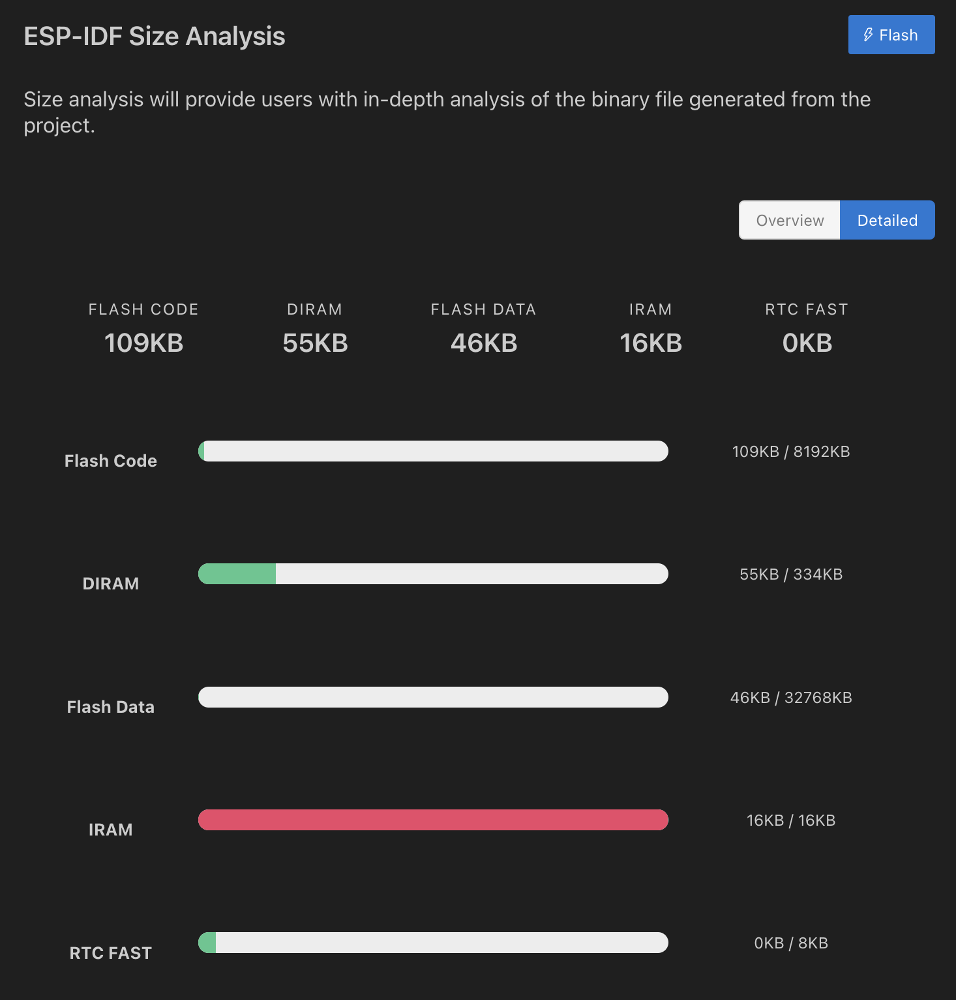

| Supported Targets | ESP32-C2/C3 | ESP32-C5/C6 | ESP32-H2 | ESP32-P4 | ESP32-S2/S3 | T-Display-S3/...S3-AMOLED |
| ----------------- |  ---------- | ----------- | -------- | -------- | ----------- | ------------------------- |
# esp-idf-i2c-mcp23017
## Inhaltsverzeichnis
- [Überblick](#überblick)
- [Software-Vorrausetzungen](#software-vorrausetzungen)
- [Hardware-Vorrausetzungen](#hardware-vorrausetzungen)
- [Wie benutze ich das Projekt?](#wie-benutze-ich-das-projekt)
- [Build and Flash](#build-and-flash)
- [Beispiel Ausgabe](#beispiel-ausgabe)
- [ESP-IDF Projekt Größen Analyse](#esp-idf-projekt-größen-analyse)
- [Besonderen Dank](#besonderen-dank)

## Überblick

Dies ist eine Demoanwendung für den ESP32 in der ESP-IDF Umgebung V5.4 mit der neueren I2C-API "i2c_master".<br>
In ESP-IDF 5.4 hat Espressif die I²C-API überarbeitet und verbessert. Daher musste die Header-Datei mcp23017.h erheblich angepasst werden.

Diese API-Struktur mit „Handles“ und Konfigurationsobjekten ist typisch für die neuere ESP-IDF I²C API und unterscheidet sich von der älteren API:
```
i2c_master_bus_handle_t bus_handle;
i2c_master_bus_config_t bus_config = { ... };
ret = i2c_new_master_bus(&bus_config, &bus_handle);
```
Für weitere Informationen über die I²C-Adresse und andere I²C-Geräte, siehe hier:
(https://i2cdevices.org/addresses)

## Software-Vorrausetzungen
Dieser Code wurde aktualisiert und mit den folgenden Versionen kompiliert:
- VSCode: March 2025 (version 1.99.1)
- ESP-IDF 5.4.1
- CMake version 3.30.2

## Hardware-Vorrausetzungen
- ESP32 board<br> (LilyGO T-Display S3 [v1.2])
- I2C port expander MCP23017<br>
- 2x 4K7 resistors<br>
- USB cable<br>
- cable for I2C (V+, GND, SDA und SCL)<br>

## Wie benutze ich das Projekt?
Sie können diese Konfiguration für Ihr Projekt anpassen:
```
#define I2C_SCL 17
#define I2C_SDA 18
#define MCP23017_ADDR 0x20
#define I2C_FREQ_HZ 400000 // 400 kHz (100 ... 800 kHz)
```
Konfiguration des MCP23017 für dieses System
- 8x Inputs
- 8x Outputs

Die 8 Eingänge von Port A werden geprüft und an den Ausgang Port B ausgegeben.

## Build and Flash

In der Fußzeile müssen Sie die folgenden Einstellungen überprüfen und anpassen:
1. Interface Type
2. Der Port, an dem das ESP32-Board angeschlossen ist
3. tDer ESP32 type

Der I²C-Bus ermöglicht die Verwendung mehrerer Slaves (FRAMs, LCD, Sensoren, Port-Erweiterungen, etc.).
Einige I²C-Geräte haben die Pins A0, A1 und A2 für die Adresskonfiguration. Andere I²C-Slaves verfügen über Freigabepins (CS). Hier können Sie GPIO-Pins verwenden.<br>
Achtung! Die Hardware-Adressierung muss mit der Software übereinstimmen!
Das Datenblatt zeigt, wie es geht: doc/mcp23017.pdf

Siehe Animation:


## Beispiel Ausgabe
```
I (276) main.c says: MCP23017 initialized: NO ERROR
I (276) main.c says: MCP23017 Address: 0x20
I (276) main.c says: I2C Speed: 400 kHz
I (286) main.c says: INTCAP-Wert beim Interrupt: 0x7F
I (286) main.c says: MCP23017 config ok NO ERROR
I (296) main.c says: MCP23017 Port A = INPUTS, Interrupts active LOW
I (296) main.c says: MCP23017 Port B = OUTPUTS

I (156386) main.c says: Time measurement: Current iteration: 347 µs, Average: 349 µs
I (158126) main.c says: Port B: 0xBF (Bits: 10111111)
```

## ESP-IDF Projekt Größen Analyse

Das ESP-IDF-Tool zur Analyse der Anwendungsgröße bietet eine detaillierte Aufschlüsselung der Speicherauslastung Ihrer Anwendung und hilft Entwicklern, die Speicherzuweisung zu optimieren.<br>

Navigaiere zu:
<br>
Press Taste: shift + >  type: `ESP-IDF: Size Analyse of the Binaries`<br>
<br>
<br>



## Besonderen Dank
an NSBum. Er stellte den älteren Code zur Verfügung, den ich geändert/angepasst habe. https://github.com/NSBum/
